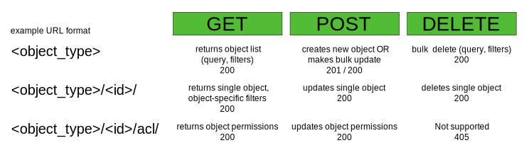

==================
KEY API PRINCIPLES
==================

The DATA API is designed in a RESTful way, e.g. to have similar routines for creating, updating and selecting different objects that API supports. 

--------------------
Request and Response
--------------------

All operations are made using HTTP requests with JSON as a main request and response format. The API supports GET, POST and DELETE request types. Generally, GET requests are used to query objects and related data, POST requests create or update RESTful objects, DELETE requests move objects to the archive. Specifically, the following matrix summarizes which example URLs you should use to request a certain operation:

All URLs must have a host prefix, e.g. https://portal.g-node.org/data/. These operations are described in detail within document sections below.

A typical GET request should have a form like

 ::

    Request: GET /<namespace>/<object_type>/[<object_id>]/[?<params>]

for example, 

 ::

    Request: GET /electrophysiology/spiketrain/1546/

returns the spiketrain object with an ID = 1546 in JSON format.

When you need to create or update object(s), you send a POST request with the same URL syntax. Data, sent together with the POST request should be in a JSON format, for example:

 ::

    Request: POST /electrophysiology/spiketrain/1546/

    {
        "name": "SP-1546",
        "comment": "spiketrain computed using Quiroga et al."
    }

will make an update fields "name" and "comment" in the spiketrain object with an ID = 1546.

A typical response will look like this:

::

    HTTP SUCCESS (200)

    {
        "logged_in_as": "jeff",
        "objects_selected": 1,
        "selected": [
            {
                "fields": {
                    "id": 2,
                    "guid": "88aa2089cfc73e9279231c5518702222e5b8bb0d",
                    "name": "V1 FIX signals, trial 1",
                    "analogsignal_set": [
                        "http://141.84.42.103:8010/electrophysiology/analogsignal/2",
                        "http://141.84.42.103:8010/electrophysiology/analogsignal/178",
                    ],
                    "current_state": 10,
                    "safety_level": 3,
                    "owner": "http://141.84.42.103:8010/profiles/profile/5",
                    "date_created": "2012-07-26T17:16:07",
                    "block": "http://141.84.42.103:8010/electrophysiology/block/1",
                    "metadata": []
                },
                "model": "neo_api.segment",
                "permalink": "http://141.84.42.103:8010/electrophysiology/segment/2"
            },
            {
                ...
            }
        ],
        "selected_range": [ 0, 5 ],
        "message": "Here is the list of requested objects.",
        "message_type": "object_selected"
    }

There are several response codes supported (200, 201, 400, etc.), please refer to :ref:`HTTP messages <HTTP_Messages>`. Use "message" and "message_type" parameters to learn about the exceptions happened.

Almost every response has parameters like
 * "logged_in_as" - a name of the user currently logged in
 * "objects_selected" - a number of the objects selected as a result of the request
 * "selected" - is always a list containing JSON structures of the resulting objects
 * "selected_range" has the first and the last index of the selected objects
 * "message" and "message_type" used to provide details about an action made

A typical structure of a single object contains:
 * "permalink" - a :ref:`permanent object URL <common_terms>`
 * "model" - a reference to the object model in a form <namespace>.<object_type>
 * "fields" - a list of actual object attributes and relationships

In "fields" you will always find:
 * "id" - an integer ID of an object
 * "guid" - a unique object identifier (changes if any attribute of an object changes)
 * "current_state" indicates an active (10) or deleted (20) object
 * "safety_level" defines a general object access level, like (1) - public, (2) - friendly, (3) - private (default). See more about permissions in :ref:`permissions <permissions>` section.
 * "owner" - a :ref:`permalink <common_terms>` to the owner of an object
 * "date_created" is obviously an object creation date.

plus some other attributes, specific to the current object.

If an object has a parent (many-to-one relationship), an appropriate field will contain a permalink to this parent object or null, if empty. An example would be the "block" key in the response above.

If an object has children (one-to-many relationship), you should be able to find a list containing children permalinks under the key named "<child_type>_set". An example would be the "analogsignal_set" key in the response above, which contains :ref:`AnalogSignal <AnalogSignal>` objects belonging to a certain :ref:`Segment <Segment>`.

Some attributes, especially the ones having units, are presented in a special form like

::

    "time": {
        data: 35,
        units: ms
    }

You may find them as "data" fields for every object described in :doc:`Object model <../terminology>`.

-------------------
Headers and Caching
-------------------

When requesting single object, the response header will contain ETag and Last-Modified parameters. They could be useful to implement some sort of for caching on the API Client side. A typical response header should look like this:

::

    Content-Language:en
    Content-Length:0
    Content-Type:text/html; charset=utf-8
    Date:Wed, 31 Oct 2012 14:10:20 GMT
    ETag:"88aa2089cfc73e9279231c5518702222e5b8bb0d"
    Last-Modified:Thu, 26 Jul 2012 17:16:07 GMT
    Server:WSGIServer/0.1 Python/2.6.6
    Vary:Accept-Language, Cookie

.. api_principles_list:

--------------------
Requesting object(s)
--------------------

To get the list of available objects of a specific type (e.g. :ref:`AnalogSignal <AnalogSignal>`, or a :ref:`Section <Section>`, or a :ref:`Datafile <Datafile>`) you need to send a GET request to the URL, ending with the name of this type, for example:

 ::

    Request: GET /electrophysiology/analogsignal/

or

 ::

    Request: GET /metadata/sections/

You may filter the list of objects by owner, permissions or specific conditions on the attributes, specifying criterias directly in the GET as parameters. To filter by owner, include owner=<user_name> or owner=<user_ID> parameters. Specify safety_level=3 or safety_level=1 to get only private or public objects respectively. That is basically applicable to any attribute: to filter by attribute (field lookups) you need to provide attribute name followed by a double underscore and a lookup type. For example 

 ::

    Request: GET /metadata/sections/?owner=alex&safety_level=1&name__icontains=experiment

filters Alex's publicly available metadata :ref:`sections <Section>` containing 'experiment' in the name, or

 ::

    Request: GET /metadata/sections/?date_created__gt=2012-02-23 13:20:11

filters out all objects created before February, 23 2012. For more information on filtering consider :doc:`search and query <query>` section.

.. _offset_parameter:

DATA API limits the number objects to be retrieved in one request by 100. If there are more than a 100 objects you should request them using offset=100 (offset=200 etc.). You may also limit the number of objects by max_results=<some_number> parameter. The start / end indexes for the selected objects are usually contained in the response as "selected_range". For example, in case there are more than 500 objects, the following request:

 ::

    Request: GET /metadata/sections/?offset=120&max_results=300

will retrieve 300 objects, indexed from 120 to 419 respectively.

To get a single object you should specify its ID at the end of the URL:

 ::

    Request: GET /metadata/sections/10/

.. _q_parameter:

You may also control the amount of the information about avery object you receive using the 'q' parameter. You may provide q=
    - 'link' - just permalink and some basic fields
    - 'full' - everything: all attributes plus up- and down- stream relations
This works with both list of objects and single objects. For example

 ::

    Request: GET /metadata/sections/2/?q=full

will retrieve the full information about the section:

 ::

    HTTP SUCCESS (200)

    {
        "logged_in_as": "bob",
        "objects_selected": 1,
        "selected": [{
            "fields": {
                "parent_section": null,
                "tree_position": 1,
                "odml_type": 20,
                "name": "stimulus",
                "datafile_set": [],
                "property_set": [
                    "metadata/properties/10",
                    "metadata/properties/11",
                    "metadata/properties/15"
                ],
                "current_state": 10,
                "is_template": false,
                "last_modified": "2012-03-05 16:45:26",
                "safety_level": 2,
                "block_set": [],
                "owner": 2,
                "date_created": "2012-02-23 18:19:53",
                "section_set": [
                    "metadata/sections/4",
                    "metadata/sections/6"
                ],
                "user_custom": null,
                "description": ""
            },
            "model": "metadata.section",
            "permalink": "metadata/sections/2"
        }],
        "message": "Here is the list of requested objects.",
        "selected_range": [0, 0],
        "message_type": "object_selected"
    }

----------------------------------------
Updating an object or making bulk update
----------------------------------------

To update one or several attributes of an object send POST to the object permalink, providing new parameters / values in the POST body. For example, this request updates the name and comment for the property with ID 2:

 ::

    Request: POST /metadata/properties/2/

    {
        "name": "15 - here is new name",
        "comment": "We just changed the property name"
    }

Bulk object update is also possible. To make changes to several objects at once, you need to use the object type URL (like /<namespace>/<object_type>/) and provide bulk_update=1 parameter. Changes will be applied to all objects in the selection; use filters so select only objects, that are needed to be changed. The following resuest moves all properties with name having "sampling" to the section with ID 146:

 ::

    Request: POST /metadata/properties/2/?name__icontains=sampling&bulk_update=1

    {
        "section": 146
    }

-------------------
Creating new object
-------------------

Send the POST request to the object type URL (like /<namespace>/<object_type>/) to create new object. The POST data request should contain a JSON object with at least mandatory fields, required to create a new object. For example, to create a new :ref:`event <Event>` labeled "stimulus onset" in the :ref:`segment <Segment>` with ID = 1 supply the following:

 ::

    Request: POST /electrophysiology/event/

    {
        "label": "stimulus onset",
        "time": {
            "units": "ms",
            "data": 65
        },
        "segment": 1
    }

The response should look like this:

 ::

    201 CREATED

    {
    "logged_in_as": "jeff",
    "objects_selected": 1,
    "selected": [(1)
    {
        "fields": {
            "id": 2,
            "current_state": 10,
            "label": "stimulus onset",
            "safety_level": 3,
            "time": {
                "units": "ms",
                "data": 65
            },
            "date_created": "2012-10-31T13:29:28",
            "guid": "b5aeacbcbbe19bc52ce71d0501b3b2cea3e89c0e",
            "segment": "http://141.84.42.103:8010/electrophysiology/segment/1",
            ...
        },
        "model": "neo_api.event",
        "permalink": "http://141.84.42.103:8010/electrophysiology/event/2"
    }
    ],
    ...
    }

----------------
Delete object(s)
----------------

Send the DELETE request to an object permalink to permanently archive it. A DELETE request to a :ref:`list <api_principles_list>` will archive all objects within the list. For example, to remove all :ref:`events <Event>` from a particular :ref:`segment <Segment>` with ID = 12 send

 ::

    Request: DELETE /electrophysiology/event/?segment=12

-----------
Permissions
-----------

Almost all object in the system can have different permissions assigned via so-called Access Lists (ACL). To get an access list for a particular object use

 ::

    Request: GET /electrophysiology/event/1345/acl/

A typical ACL looks like

 ::

    {
        ...
        "safety_level": 3,
        "shared_with": {
            "jeff": 1,
            "bob": 2,
            "rachel": 1,
        }
    }

where "safety_level" defines a general object access level with
 1 public
 2 friendly, and
 3 private (default)
state, and a "shared_with" key handles a list of users, having access to the object (with 1 - "read-only" and 2 - "edit" roles). See more about permissions in :ref:`permissions <permissions>` section.

.. _HTTP_Messages:

-------------
HTTP Messages
-------------

Here is the list of typical HTTP response status codes and a brief explanation of their meaning.

============    ====    ===============
Response        Code    Information
============    ====    ===============
Success         200     successful operation, typically GET or DELETE
Created         201     object was created successfuly
BadRequest      400     an exception occured. It could happen if a non-existing object is referenced, or any index for a list was incorrect. Any parsing error of the incoming JSON will lead to this response type. Any validation exception will return this response too.
Unauthorized    401     user is not logged in
Forbidden       403     a currently logged-in user has no permissions to access or modify an object
NotFound        404     a wrong URL or object was not found
NotSupported    405     this type of HTTP request is not supported
============    ====    ===============

