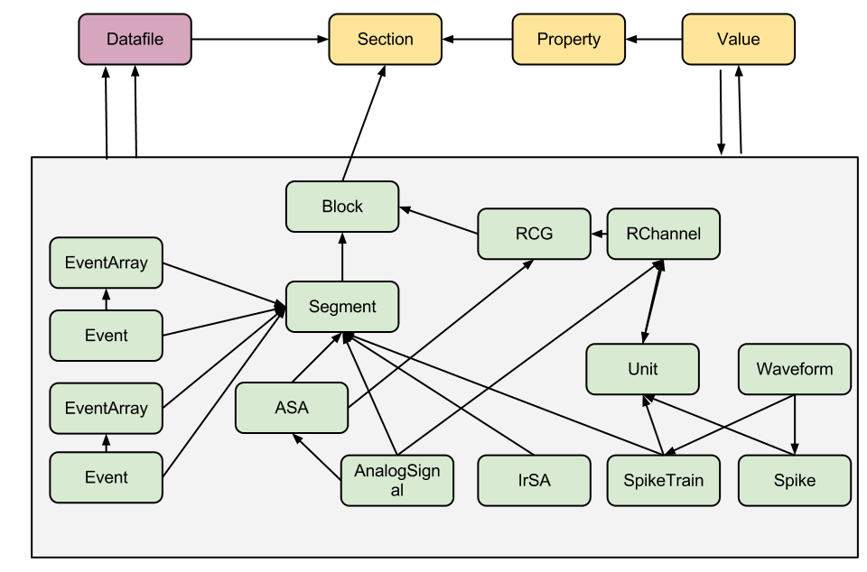

======================
Objects and data model
======================

-----------------
Electrophysiology
-----------------

The overall data model for electrophysiology looks like this:

.. image:: ../_static/ephys_om.png
    :width: 800 px
    :align: center

Every object in this context has a set of *attributes* and *data fields*, it may also have relationships, like *parents* and *children*. For example, a Segment_ has to have an attribute 'name'. AnalogSignal_ should have a 'sampling_rate' data field, which consists of the unit (like Hz or KHz) and a value (like 20000). A Block_ consists of Segment_ objects, which means the Block_ has a child Segment_, and a Segment_ has a parent Block_. Below for each object you can find its definition, as well as the detailed listing of its attributes and relationships.

.. _available_units:

*Note. Some attributes have units. Here is the list of available units values:*

 * in the time domain:
   * "s", "ms", "us"
 * in the signal domain:
   * "V", "mV", "uV"
 * in the signal sampling domain:
   * "Hz", "KHz", "MHz", "1/s"

*Note. Attributes with \* asterisk are mandatory.*

:ref:`ePhys Objects <ePhys Objects>` consist of:

.. _AnalogSignal:

^^^^^^^^^^^^
AnalogSignal
^^^^^^^^^^^^

    A regular sampling of a continuous, analog signal.

==================   ==========================
Parameter            Type
==================   ==========================
name\*               string
sampling_rate\*      float + units
t_start\*            float + units
signal\*             array of floats 1D + units
segment              foreign key to Segment_
recordingchannel     foreign key to RecordingChannel_
==================   ==========================

See exact JSON object representation in :doc:`JSON DATA API <data_api/object_examples>`.
 

.. _IrSaAnalogSignal:

^^^^^^^^^^^^^^^^
IrSaAnalogSignal
^^^^^^^^^^^^^^^^

    An analog signal with non-regular sampling.

==================   ==========================
Parameter            Type
==================   ==========================
name\*               string
t_start\*            float + units
signal\*             array of floats 1D + units
times\*              array of floats 1D + units
segment              foreign key to Segment_
recordingchannel     foreign key to RecordingChannel_
==================   ==========================

See exact JSON object representation in :doc:`JSON DATA API <data_api/object_examples>`.
 

.. _AnalogSignalArray:

^^^^^^^^^^^^^^^^^
AnalogSignalArray
^^^^^^^^^^^^^^^^^

    A regular sampling of a multichannel continuous analog signal. This representation (as a 2D array) may be more efficient for subsequent analysis than the equivalent list of individual AnalogSignal objects.

=====================   ==========================
Parameter               Type
=====================   ==========================
t_start\*               float + units
sampling_rate\*         float + units
signal\*                array of floats 2D + units
segment                 foreign key to Segment_
recordingchannelgroup   foreign key to RecordingChannelGroup_
=====================   ==========================

See exact JSON object representation in :doc:`JSON DATA API <data_api/object_examples>`.
 

.. _Spike:

^^^^^
Spike
^^^^^

    One action potential characterized by its time and waveform.

=====================   ==========================
Parameter               Type
=====================   ==========================
time\*                  float + units
sampling_rate\*         float + units
left_sweep              float + units
waveform\*              array of floats 2D + units
segment                 foreign key to Segment_
unit                    foreign key to Unit_
=====================   ==========================

See exact JSON object representation in :doc:`JSON DATA API <data_api/object_examples>`.

.. _SpikeTrain:

^^^^^^^^^^
SpikeTrain
^^^^^^^^^^

    A set of action potentials (spikes) emitted by the same unit in a period of time (with optional waveforms).

=====================   ==========================
Parameter               Type
=====================   ==========================
t_start\*               float + units
t_stop\*                float + units
times\*                 array of floats 1D + units
waveforms               array of floats 3D + units
segment                 foreign key to Segment_
unit                    foreign key to Unit_
=====================   ==========================

See exact JSON object representation in :doc:`JSON DATA API <data_api/object_examples>`.

.. _Event:

^^^^^^^^^^^^^^^^^^^^
Event and EventArray
^^^^^^^^^^^^^^^^^^^^

    A time point representng an event in the data, or an array of such time points.

=====================   ==========================
Parameter               Type
=====================   ==========================
label(s)\*              string/array of strings 1D
time(s)\*               float/array of floats 1D + units
segment                 foreign key to Segment_
=====================   ==========================

See exact JSON object representation in :doc:`JSON DATA API <data_api/object_examples>`.

.. _Epoch:

^^^^^^^^^^^^^^^^^^^^
Epoch and EpochArray
^^^^^^^^^^^^^^^^^^^^
    An interval of time representing a period of time in the data, or an array of such intervals.

=====================   ==========================
Parameter               Type
=====================   ==========================
label(s)\*              string/array of strings 1D
time(s)\*               float/array of floats 1D + units
duration(s)\*           float/array of floats 1D + units
segment                 foreign key to Segment_
=====================   ==========================

See exact JSON object representation in :doc:`JSON DATA API <data_api/object_examples>`.

:ref:`ePhys Objects <ePhys Objects>` comprise a simple hierarchy of containers:

.. _Segment:

^^^^^^^
Segment
^^^^^^^

    A container for heterogeneous discrete or continous data sharing a common clock (time basis) but not necessarily the same sampling rate, start time or end time. A Segment can be considered as equivalent to a “trial”, “episode”, “run”, “recording”, etc., depending on the experimental context. May contain any of the :ref:`ePhys Objects <ePhys Objects>`.

=====================   ==========================
Parameter               Type
=====================   ==========================
name\*                  string
filedatetime            datetime
index                   int
block                   foreign key to Block_
=====================   ==========================

Segment can contain objects of the following types:
 * AnalogSignal_
 * IrSaAnalogSignal_
 * AnalogSignalArray_
 * SpikeTrain_
 * Spike_
 * Event_ and array of events
 * Epoch_ and array of epochs

See exact JSON object representation in :doc:`JSON DATA API <data_api/object_examples>`.

.. _Block:

^^^^^
Block
^^^^^

    The top-level container gathering all of the data, discrete and continuous, for a given recording session. Contains Segment_ and RecordingChannelGroup_ objects.

=====================   ==========================
Parameter               Type
=====================   ==========================
name\*                  string
filedatetime            datetime
index                   int
section                 foreign key to Section_
=====================   ==========================

Block can contain objects of the following types:
 * Segment_
 * RecordingChannelGroup_

See exact JSON object representation in :doc:`JSON DATA API <data_api/object_examples>`.

:ref:`ePhys Objects <ePhys Objects>` also include *Grouping objects*. These objects express the relationships between data items, such as which signals were recorded on which electrodes, which spike trains were obtained from which membrane potential signals, etc. They contain references to data objects that cut across the simple container hierarchy.

.. _RecordingChannel:

^^^^^^^^^^^^^^^^
RecordingChannel
^^^^^^^^^^^^^^^^

    Links AnalogSignal_ and/or SpikeTrain_ objects that come from the same logical and/or physical channel inside a Block_, possibly across several Segment_ objects.

=====================   ==========================
Parameter               Type
=====================   ==========================
name\*                  string
index                   int
recordingchannelgroup   foreign key to RecordingChannelGroup_ 
=====================   ==========================

RecordingChannel can contain objects of the following types:
 * Unit_
 * AnalogSignal_
 * IrSaAnalogSignal_

See exact JSON object representation in :doc:`JSON DATA API <data_api/object_examples>`.

.. _RecordingChannelGroup:

^^^^^^^^^^^^^^^^^^^^^
RecordingChannelGroup
^^^^^^^^^^^^^^^^^^^^^
    A group for associated RecordingChannel objects. This has several possible uses: for linking several AnalogSignalArray objects across several Segment objects inside a Block, for multielectrode arrays, where spikes may be recorded on more than one recording channel, and so the RecordingChannelGroup can be used to associate each Unit with the group of recording channels from which it was calculated, as well as for grouping several RecordingChannel objects. There are many use cases for this. For instance, for intracellular recording, it is common to record both membrane potentials and currents at the same time, so each RecordingChannelGroup may correspond to the particular property that is being recorded. For multielectrode arrays, RecordingChannelGroup is used to gather all RecordingChannel objects of the same array.

=====================   ==========================
Parameter               Type
=====================   ==========================
name\*                  string
block                   foreign key to Block_ 
=====================   ==========================

RecordingChannelGroup can contain objects of the following types:
 * RecordingChannel_
 * AnalogSignalArray_

See exact JSON object representation in :doc:`JSON DATA API <data_api/object_examples>`.

.. _Unit:

^^^^
Unit
^^^^

    A Unit gathers all the `SpikeTrain`_ objects within a common Block_, possibly across several Segments, that have been emitted by the same cell. A Unit is linked to RecordingChannelGroup_ objects from which it was detected.

=====================   ==========================
Parameter               Type
=====================   ==========================
name\*                  string
recordingchannel        foreign key to RecordingChannel_ 
=====================   ==========================

Unit can contain objects of the following types:
 * SpikeTrain_
 * Spike_

See exact JSON object representation in :doc:`JSON DATA API <data_api/object_examples>`.

--------
Metadata
--------

The general metadata object model looks like:

.. image:: ../_static/metadata_om.png
    :align: center

it is implemented inline with `odML <http://www.g-node.org/projects/odml>`_ concept and consists of objects like Section_, `Properties with Values`_.  Here goes the complete metadata objects specification.

.. _Section:

^^^^^^^
Section
^^^^^^^

    An element used to group and organize your metadata in a tree structure. Intuitively it's like a folder in a usual file system. A Section can contain other Sections, `Properties with Values`_, Datafile_ or Block_. The Section is a prototype of the `odML® <http://www.g-node.org/projects/odml>`_ section and is implemented inline with odML concepts and methodology.

=====================   ==========================
Parameter               Type
=====================   ==========================
name\*                  string
description             string
odml_type               int (0-99)
tree_position           int
parent_section          foreign key to Section_ 
=====================   ==========================

Section can contain objects of the following types:
 * Section_
 * Block_
 * Datafile_

See exact JSON object representation in :doc:`JSON DATA API <data_api/object_examples>`.

.. _`Properties with Values`:

^^^^^^^^^^^^^^^^^^^^^
Properties and Values
^^^^^^^^^^^^^^^^^^^^^

    Inspired by the "key-value pairs" concept, Properties and Values used similarly as a flexible way to annotate your data (implemented in line with `odML <http://www.g-node.org/projects/odml>`_) within any metadata Section_. Some good examples could be a model of your recording device, duration of the stimulus, a layer of the cell you've recorded from. Properties and Values can be used to "label" your :ref:`ePhys Objects <ePhys Objects>` (AnalogSignal_, SpikeTrain_ etc.) to indicate certain metadata for them. 

Property:

=====================   ==========================
Parameter               Type
=====================   ==========================
name\*                  string
definition              string
dependency              string
dependency_value        string
mapping                 string
unit                    string
dtype                   string
uncertainty             string
comment                 string
section\*               foreign key to Section_ 
=====================   ==========================

Property can contain one or several value objects:

Value:

=====================   ==========================
Parameter               Type
=====================   ==========================
data\*                  string
parent_property\*       foreign key to Section_ 
=====================   ==========================

See exact JSON object representation in :doc:`JSON DATA API <data_api/object_examples>`.

.. _Datafile:

-----
Files
-----

^^^^^^^^
Datafile
^^^^^^^^

    Datafile represents an arbitrary file, uploaded by a user. Some data or metadata can be extracted from the Datafile if it is in one of the supported formats (`NEO I/O <http://neo.readthedocs.org/en/latest/io.html>`_, `Neuroshare <http://neuroshare.sourceforge.net/index.shtml>`_, `odML <http://www.g-node.org/projects/odml>`_). All data-related objects, like AnalogSignal_ or Spike_, have their data part also stored as HDF5 files (`what is HDF5? <http://www.hdfgroup.org/HDF5/whatishdf5.html>`_), having array in the file root.

=====================   ==========================
Parameter               Type
=====================   ==========================
name\*                  string
caption                 string
section\*               foreign key to Section_
=====================   ==========================

The system supports data conversion from files to the :ref:`ePhys <ePhys Objects>` and Metadata_ objects, listed above, if the Datafile_ is compartible with supported formats (see Datafile_ above).

-------------------
Full model overview
-------------------

Just to summarize this document, the data model for the whole system looks like:

