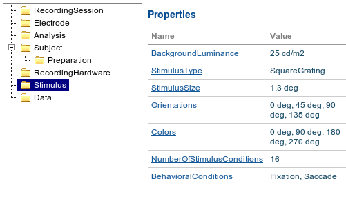

======================================
Terminology used in this specification
======================================

Throughout this specification, it's refered to a series of terms like Section_ or Datafile_, which are intended to have specific meanings.

.. _Datafile:

**Datafile**
    Datafile represents an arbitrary file, uploaded by a user. Some data or metadata can be extracted from the Datafile if it is in one of the supported formats (`NEO I/O <http://neo.readthedocs.org/en/latest/io.html>`_, `Neuroshare <http://neuroshare.sourceforge.net/index.shtml>`_, `odML <http://www.g-node.org/projects/odml>`_). All data-related objects, like AnalogSignal_ or Spike_, have their data part also stored as HDF5 files (`what is HDF5? <http://www.hdfgroup.org/HDF5/whatishdf5.html>`_), having array in the file root.

.. _`ePhys Objects`:

**ePhys Objects**
    ePhys Objects should be used to represent the recorded (raw) electrophysiological data in a flexible, but consistent way. An original concept is described `here <http://neo.readthedocs.org/en/latest/core.html>`_, however we provide all descriptions down below for convenience. ePhys Objects directly represent raw data structure with data as arrays of numerical values with associated mandatory attributes (units, sampling frequency, etc.).

`ePhys Objects`_ consist of:

.. _AnalogSignal:

**AnalogSignal**
    A regular sampling of a continuous, analog signal.

**AnalogSignalArray**
    A regular sampling of a multichannel continuous analog signal. This representation (as a 2D array) may be more efficient for subsequent analysis than the equivalent list of individual AnalogSignal objects.

.. _Spike:

**Spike**
    One action potential characterized by its time and waveform.

.. _SpikeTrain:

**SpikeTrain**
    A set of action potentials (spikes) emitted by the same unit in a period of time (with optional waveforms).

.. _Event:

**Event and EventArray**
    A time point representng an event in the data, or an array of such time points.

.. _Epoch:

**Epoch and EpochArray**
    An interval of time representing a period of time in the data, or an array of such intervals.

There is also a simple hierarchy of containers:

.. _Segment:

**Segment**
    A container for heterogeneous discrete or continous data sharing a common clock (time basis) but not necessarily the same sampling rate, start time or end time. A Segment can be considered as equivalent to a “trial”, “episode”, “run”, “recording”, etc., depending on the experimental context. May contain any of the `ePhys Objects`_.

.. _Block:

**Block**
    The top-level container gathering all of the data, discrete and continuous, for a given recording session. Contains Segment_ and RecordingChannelGroup_ objects.

`ePhys Objects`_ also include *Grouping objects*. These objects express the relationships between data items, such as which signals were recorded on which electrodes, which spike trains were obtained from which membrane potential signals, etc. They contain references to data objects that cut across the simple container hierarchy.

.. _RecordingChannel:

**RecordingChannel**
    Links AnalogSignal_ and/or SpikeTrain objects that come from the same logical and/or physical channel inside a Block, possibly across several Segment objects.

**RecordingChannelGroup**
    A group for associated RecordingChannel objects. This has several possible uses: for linking several AnalogSignalArray objects across several Segment objects inside a Block, for multielectrode arrays, where spikes may be recorded on more than one recording channel, and so the RecordingChannelGroup can be used to associate each Unit with the group of recording channels from which it was calculated, as well as for grouping several RecordingChannel objects. There are many use cases for this. For instance, for intracellular recording, it is common to record both membrane potentials and currents at the same time, so each RecordingChannelGroup may correspond to the particular property that is being recorded. For multielectrode arrays, RecordingChannelGroup is used to gather all RecordingChannel objects of the same array.

.. _Unit:

**Unit**
    A Unit gathers all the `SpikeTrain`_ objects within a common Block_, possibly across several Segments, that have been emitted by the same cell. A Unit is linked to RecordingChannelGroup_ objects from which it was detected.

Intuitively, these objects can be all drawn on this diagram:

.. image:: ../_static/ephys_basic.png
    :align: center

So the overall `ePhys Objects`_ model looks like

.. image:: ../_static/ephys_om.png
    :width: 800 px
    :align: center

However, having `ePhys Objects`_ is usually not enough to describe the whole experiment. For other information, like the description of an Animal or a Stimuli, we use Metadata_.

.. _Metadata:

**Metadata**
    In this context metadata is any information about an experiment, excluding the information, described using `ePhys Objects`_. Work with metadata is essentially is a flexible way to describe your experimental parameters using Section_ (simple container) tree with `Properties with Values`_ (key-value pairs). For example, it may look like this:

So in general, the metadata object model looks like:

.. image:: ../_static/metadata_om.png
    :align: center

which is implemented inline with `odML <http://www.g-node.org/projects/odml>`_ concept and consists of objects like Section_, `Properties with Values`_.

.. _Section:

**Section**
    An element used to group and organize your metadata in a tree structure. Intuitively it's like a folder in a usual file system. A Section can contain other Sections, `Properties with Values`_, Datafile_ or Block_. The Section is a prototype of the `odML <http://www.g-node.org/projects/odml>`_® section and is implemented inline with odML concepts and methodology.

.. _`Properties with Values`:

**Properties and Values**
    Inspired by the "key-value pairs" concept, Properties and Values used similarly as a flexible way to annotate your data (implemented in line with `odML <http://www.g-node.org/projects/odml>`_) within any metadata Section_. Some good examples could be a model of your recording device, duration of the stimulus, a layer of the cell you've recorded from. Properties and Values can be used to "label" your `ePhys Objects`_ (AnalogSignal_, SpikeTrain_ etc.) to indicate certain metadata for them. 

The system supports data conversion from files to the data and metadata objects, listed above, if the Datafile_ is compartible with supported formats (see Datafile_ above).

.. _Data annotation:

**Data annotation**
    Data annotation is the process of assinging metadata to the data, when some special connection is required. It is needed basically in order to establish a connection between data and metadata for easy search and generic access. An example could be a case when you, say, described the color of your Stimuli as a property in a Stimuli section, and after you acquire the data you need to indicate, which particular signals were recorded at which particular color frequency. In this case, data annotation means establishing a link between particular signals and particular values of the color property.

