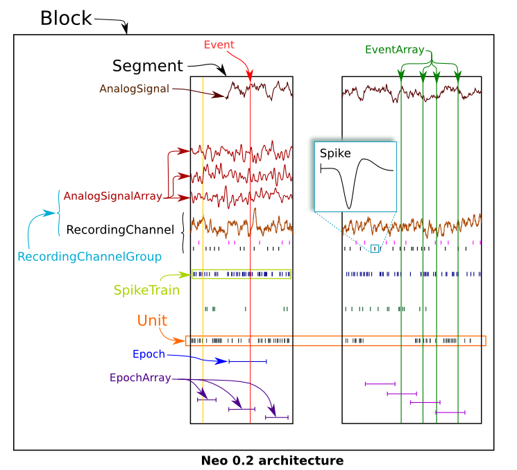
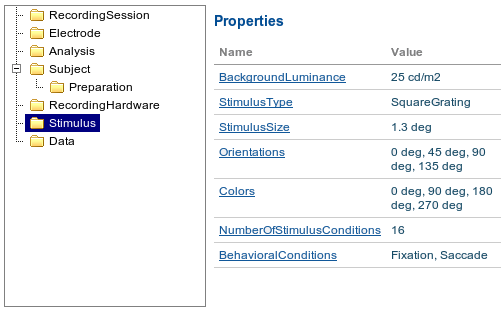

.. _overview:

Overview
========

The aim of the G-Node Portal is to provide a platform for Neuroscientists for data storage, analysis and exchange. It was designed to support normal experimental workflow, so you may use it from your familiar analytical environment, like Matlab or Python. Here we give an overview of the platform and available services.

The goal of this document is to present you the potential usage of the platform for your specific experimental workflow. If you want to try it now or you're ready for a more detailed description - please `login <https://portal.g-node.org/data/>`_ or `sign up <https://portal.g-node.org/data/account/signup/>`_, or proceed with our tutorials (:doc:`tutorial for Matlab users <tutorial_matlab>` | :doc:`tutorial for Python users <tutorial_python>`).

.. _overview_ephys:

.. _search_overview:

------------------------------
Start by searching public data
------------------------------

-------------------------------
Organize your experimental Data
-------------------------------

Intuitively, these objects can be all drawn on this diagram:

.. _overview_metadata:

------------------------------
Create your metadata structure
------------------------------

.. _annotation_example:

-----------------
Annotate datasets
-----------------

Imagine you have an experiment with stimulus which changes its color across experimental trials. The "color" is an arbitrary parameter, we cannot predict the exact setup of your experimental study. In your future research you want to indicate, which signals were recorded under which stimulus color, to be able to perform some valueable data analysis. Essentially this is a need to connect recorded signal data with arbitrary metadata; we call this "data annotation" process. In this section we describe how it works.

The idea is that you use objects in electrophysiology ...

Assume you want to group channels by some spatial property, and later compare the results from this group to the results from all channels. Bla..

Assume in the experiment section tree you already defined a property, say, "Stimulus Color" with values "red, green and blue". In that case, annotate all required Analog Signals with appropriate metadata values, assigning a "red" value to the signals recorded when the Stimulius was red etc.

.. _query_overview:

----------------------
Query your experiments
----------------------

This section is being described..

.. _sharing_overview:

--------------------------------
Open your data for Collaborators
--------------------------------

There is a possibility to share your data with other users in the G-Node Portal. When you share an object, it immediately becomes accessible for the users depending on the access level you select. In case an object is a container (has downstream relations, like a :ref:`Segment <Segment>` can have :ref:`Events <Event>`), you may share an object recursively, which implies all children objects in the selected object with all their contents will become shared. Object sharing is controlled via the object safety level (kind of a sharing state) and :ref:`access control list <acl_term>`. Object's safety level can be
 * private — noone, except users, specified explicitly in the Access Control List, may see the resource.
 * friendly — all friends have a reader role, with no need to assign them for every resource.
 * public — all users may see the contents of the resource.

In addition to the common object sharing state (safety level), many objects support :ref:`Access Control Lists <acl_term>`, that show who has access to a given object. 

Every object has an owner, which is always a person who initially created an object, and cannot be changed.

With no dependence on the state, people, assigned explicitly by owner of the resource as readers or writers, have corresponding access to the resource.

.. _track_changes:

-------------
Track changes
-------------

This section is being described..

.. _bulk_upload:

----------------
Bulk data upload
----------------

^^^^^^^^^^^^
Zip archives
^^^^^^^^^^^^

This section is in development..

^^^^^^^^^^^^^^^
Upload via sFTP
^^^^^^^^^^^^^^^

This section is in development..

